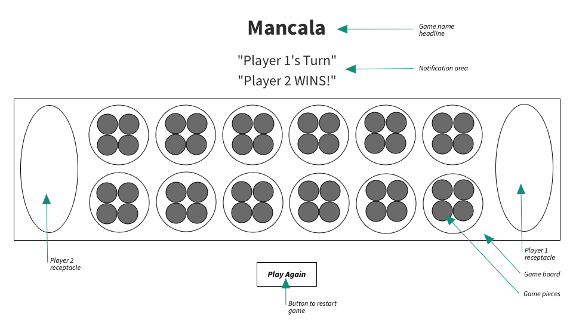
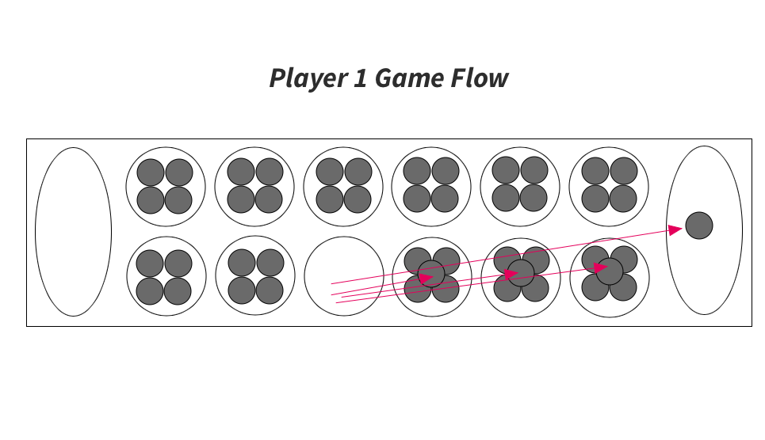

# Mancala

## Overview

Mancala is a two player board game, dating back as far as Ancient Egypt, in which players use turn-based strategy to capture all of the stones of their opponent. This program takes the age-old game into the digital world, giving players the full functionality of the physical game, with a modern twist on the gameboard aesthetics.

## User Stories

    - As a user, I want the ability to load the game.
    - As a user, I want the ability to have the application load with a new game by default.
    - As a user, I want the ability to have two players be able to play the game.
    - As a user, I want the ability to have the active player’s turn displayed.
    - As a user, I want the ability to be able to operate the gameboard by clicking on spaces to take a turn as the active player.
    - As a user, I want the ability to have the active player switch automatically once the previous player’s turn is executed.
    - As a user, I want the ability to have the winning player identified automatically after a winning play is executed.
    - As a user, I want the ability to have a tie game identified automatically.
    - As a user, I want the ability to have the winning player announced if a win is identified.
    - As a user, I want the ability to have the tie game announced if a tie game is identified.
    - As a user, I want the ability to have the ability to start a new game from a button in the application once a winner or tie game is identified.

## Wire Frames

